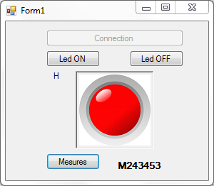
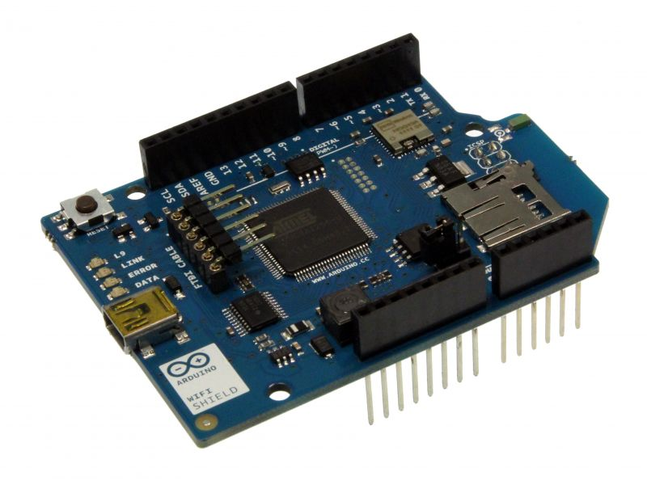

# Serveur Web WiFi basé sur l'exemple SimpleWebServerWifi

created 25 Nov 2012 
by Tom Igoe
 
Modifié le 24 Avril 2016 
par Marc Silanus
 
Allume ou Eteint la led sur la pin 9
 
Commandes reçu par socket port 5500
 
- H : allume la led
- L : éteint la led
- M : renvoi sur socket une chaine alphanumérique
 
Fonctionne avec le projet Visual studio C#
"WifiArduinoLed"

 
 # Matériel
 
- Arduino Uno ou Mega ou ...
- Shield WiFi Arduino (officiel)
- Led sur pin 9

  
sur WifiServer.ino :
 
- Modifier "ssid" avec le nom de votre réseau
- Modifier "pass" avec le mot de passe du réseau
 
 
Si pas de sécurité modifier :

WiFi.begin(ssid, pass); => WiFi.begin(ssid);
 
# Mise à jour du firmware du shield
 
 Si la version du fimware du shield wifi est antérieure à 1.1.0
 
 mettre à jour le firmware :
 http://mssystems.emscom.net/helpdesk/knowledgebase.php?article=50
